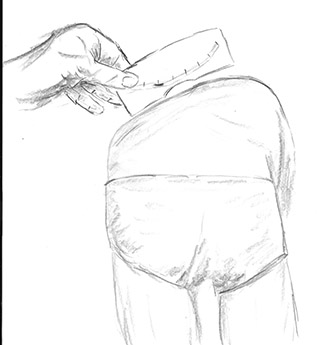
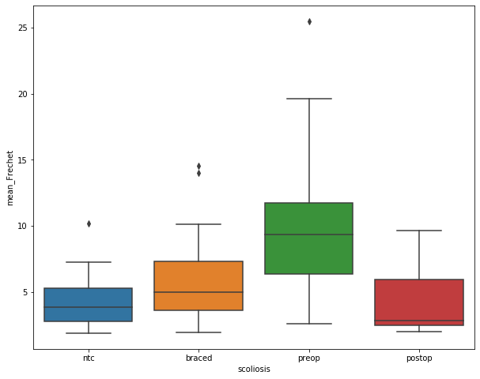
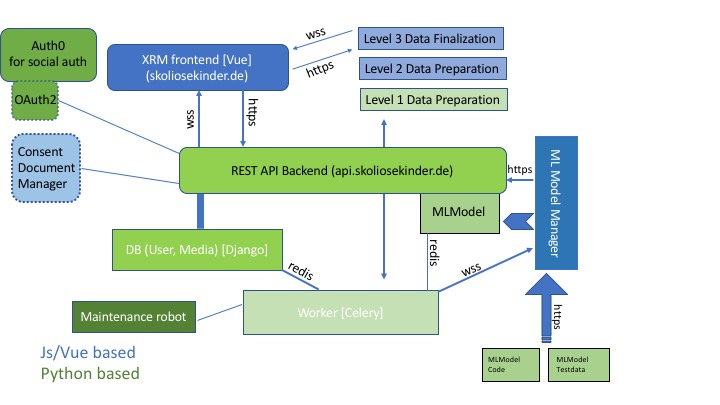

# Scoliosis detection and monitoring platform

## Medical problem
Idiopathic scoliosis can lead to severe spinal deformity in children, eventually mandating corrective and thus spinal fusion surgery.
|  |
|:---:|
| *Upright picture of severe scoliosis. Observe the asymmtry in waist delineations (1 and 2) and in shoulder height* |

This course might be prevented by early detection and monitoring of spinal asymmetry. However, one has to observe the child's back on a regular basis, especially during the growth spurt in order to catch the deformity onset.
Currently scoliosis screening measures rely on physical observation of the trunk from behind and in a bend-forward-position. 
|  |
|:---:|
| *The bend forward test exposes the asymmetric trunk rotation, a major feature of scoliosis. It can be measured with a so-called scoliosmeter. However, this is far from being precise.* | 

## The solution
The objective of this platform is, to
 - allow for quantification of trunk asymmetry from photograph images. It could be shown that the asymmetry quantification algorithm can distinguish between schildren with no scoliosis, mild or severe scoliosis. 
 - enhance precision in diagnostics. For example, Xray scoliosis angle measurement following the COBB method is burdened by an error of up to 10°. We have shown that this error can be decreased by a magnitude of 10 when a different algorithm based method is being used (https://pubmed.ncbi.nlm.nih.gov/32856177/)
 - bringing patient, parents, primary care and specialist care together without the need of time consuming visits
 - ameliorating patient compliance by giving the youth some kind of control over the course of their disease (= patient empowerment)

The product is deployed to https://skoliosekinder.de, blame me - it is all in German. I would be willing to translate, if anyone asks me to do so.

Does this sound like a good idea ? Now, why isn't it already deployed to the public?

## Obstacles
 - No Team. Without a team or some kind of professional deployment structure it is not possible to cover all the requirements that arise through the Medical Device Regulation. The above mentioned product would be classified as MDR type IIa.
 - No Money. The regulatory process will cost about 200-300 k€ plus 200 k€ for the implementation of a strong AI, adding another 100-200 k€ for a clinical study
 - Reimbursement is not clear. Although the product could be applied to any growing child, only 1-3% of the children will eventually develop scoliosis. How much money will a society be willing to spend ?
 
## Hope
I have put the complete platform on github. Maybe one day someone will fork it and we can develop it further.

# Project Structure

The platform consists of a Vue based frontend and a Django Rest Framework driven backend. Authentication can be done in two ways, either using Auth0 with social login or use the OAuth-Implementation of the backend. 

The frontend exposes the following main functions:
 - **Diskussionsraum (Chatroom)**: This is a chat-application running on a separate websocket. Chatrooms are the means to assign permissions for the access of other users resources (images). So in a real life case the parent would be owner of such a chatroom (german: Diskussionsraum) and would invite the patient (child) and the doctors. With those invitations common resources can be shared.
 - **Bildbearbeitung (Image edit)**: Photos or x-rays can be uploaded and the necessary annotations / labeling can be applied.
 - **Skolioseverlauf (Scoliosis disease course)**: charts displaying the timely change of asymmetry measurements
 - **ML Model Manager**: this is a plugin station for trained machine learning models that will be picked up by underlying processes to automate line detection and measurement in the future. Models can be tested with real life datasets.
 
 Depending on the type of user (child, doctor, parent, etc.), the endpoints will look differently.
  